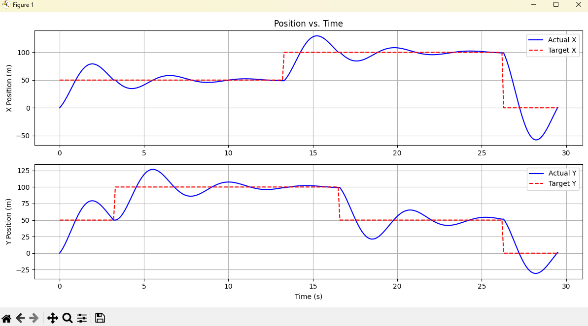

# 2D Drone Waypoint Navigation Simulator
This project is a C++ application that simulates the Guidance, Navigation, and Control (GNC) loop for a 2D quadcopter drone. The goal is to autonomously guide the drone through a series of predefined waypoints while subject to simplified physics, including mass and drag.

The project is built entirely from scratch to demonstrate a foundational understanding of GNC principles and C++ software development.

## Core Concepts
**Guidance**: The system uses a std::vector of waypoints to define the drone's mission path. The guidance logic in main.cpp determines the current target and switches to the next waypoint once the drone is within a specified threshold.

**Navigation**: In this simulation, navigation is simplified. The drone's state (position and velocity) is known perfectly at each time step. The core challenge is controlling this state.

**Control**: The system uses two independent PID (Proportional-Integral-Derivative) controllers—one for the X-axis and one for the Y-axis. These controllers calculate the necessary forces to apply to the drone to minimize the error between its current position and the target waypoint.

## Technical Stack
**Language**: C++ (C++17 standard)

**Build System**: CMake

**Analysis & Visualization**: Python with pandas and matplotlib

## How to Build and Run
**Prerequisites**

- A C++ compiler (e.g., g++ on Linux, MSVC on Windows)

- CMake (version 3.10 or higher)

- Python 3 with pip

- Python libraries: installed with
~~~
pip install pandas matplotlib
~~~

Virtual environment (optional but recommended). If you use a Python virtual environment inside the project (e.g., .venv), ensure it is activated before running Python scripts.

## Build Instructions
- Clone the repository:
~~~
git clone <repository-url>
cd 2d-drone-navigation-simulator
~~~
- Create and enter a build directory:
~~~
mkdir build
cd build
~~~
- Configure the project with CMake:
~~~
cmake ..
~~~
- Build the project and run the simulation together using the custom CMake target:
~~~
cmake --build . --target run_all
~~~
This target will:

Run the C++ simulation (drone_sim)

Then automatically run the Python script (plot_trajectory.py) using the Python interpreter from your virtual environment (if configured)

## Running Separately (Optional)
If you prefer to run steps manually:

- Build the project:
~~~
cmake --build .
~~~

- Run the simulation binary:
~~~
./drone_sim
~~~

drone_sim will generate trajectory.csv in the project root.

- Run the Python visualization:
~~~
python ../plot_trajectory.py
~~~

Make sure your virtual environment is activated if you use one.

## Results and Analysis
The primary output is the drone's flight trajectory saved in trajectory.csv. The Python visualization script plots:

The drone's 2D trajectory against waypoints

Position vs. time graphs for X and Y axes

PID controller gains (Kp, Ki, Kd) have been tuned for stable and responsive control.

## 2D Trajectory Plot
This plot shows the drone’s actual flight path (blue) and the predefined waypoints (green), illustrating the success of the guidance and control system.

## Position vs. Time Plots
These plots show the drone's X and Y positions over time compared to the target positions. They are crucial for analyzing the controller's performance, showing how quickly the drone settles at each waypoint and the amount of overshoot.

